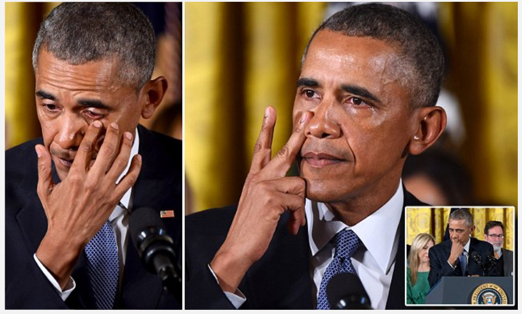

```{r, echo=FALSE, message=FALSE, warning=FALSE}
# Set R Markdown chunk defaults:
knitr::opts_chunk$set(
  echo = FALSE, message = FALSE, warning = FALSE, 
  fig.width = 16/2, fig.height = 9/2
)
```


```{r}
# Load all necessary packages here
library(leaflet)
library(dplyr)
library(sp)
library(maps)
library(leaflet.extras)
library(readr)
library(stringr)
library(mapdata)
library(ggplot2)

# Do your data loading and wrangling (if any) here:

#Read in the dataset from the Washington Post data on school shootings
school_shootings_since_columbine <- read_csv("school-shootins-since-columbine.csv")

#Select the columns that will be used to create maps and create new columns that will help with the #creation of the maps
school_shootings <- school_shootings_since_columbine %>%
  select(
  school_name,
  year,
  state,
  school_type,
  killed,
  injured,
  shooting_type,
  gender_shooter1,
  weapon,
  lat,
  long,
  resource_officer,
  casualties
  ) %>%
  mutate(fatalities = ifelse(killed == 0, "No", "Yes")) %>%
  mutate(school_type2 = paste("School Type", 
                              school_type, 
                              sep = ": ")) %>%
  mutate(resource_officer2 = paste("Resource Officers",
                                   resource_officer, 
                                   sep = ": ")) %>%
  mutate(injured2 = paste("Injured", 
                          injured, 
                          sep = ": ")) %>%
  mutate(killed2 = paste("Killed", 
                         killed, 
                         sep = ": ")) %>%
  mutate(shooting_type2 = paste("Shooting Type", 
                                shooting_type, 
                                sep = ": ")) %>%
  mutate(year2 = paste("Year of Incident", year, sep = ": "))
  
#Filter the dataset to include only incidents where the shooter was female
school_shootings_female <- school_shootings %>%
  filter(gender_shooter1 == "f")

#Filter the dataset to include only incidents where the shooter was male
school_shootings_male <- school_shootings %>%
  filter(gender_shooter1 == "m")

#Filter the dataset to include only incidents where the gender of the shooter was not listed
school_shootings_unknown <- school_shootings %>%
  filter(is.na(gender_shooter1))
      
```

# Gun Violence in U.S Schools

The United States has a gun violence problem that has reached epidemic proportions and led students to [feel unsafe at school](https://www.psychologytoday.com/us/blog/the-inner-life-students/201805/how-do-we-help-students-feel-safe-in-school-again). The country has seen [far more](https://www.cnn.com/2018/05/21/us/school-shooting-us-versus-world-trnd/index.html) school shootings than other major industrialized countries around the world. The number of school shootings is also increasing. In the past 18 years, there have been [more student deaths and injuries](https://www.springer.com/gp/about-springer/media/research-news/all-english-research-news/study-shows-rapid-rise-in-mass-school-shootings-in-the-us/15705646) during school shootings than in the 100 years prior. According to CNN, there has been [an average of 1 school shooting every week](https://www.cnn.com/2018/03/02/us/school-shootings-2018-list-trnd/index.html) of 2018. Why is this happening and how can we stop it? At this point, there seems to be a lot of conflicting opinions and no conclusive answers.
  

*The Washington Post* set out to analyze the impact of gun violence on school children. Because the U.S. government does not keep a record of school shootings, they gathered this information from various sources and then [created a dataset](https://www.nytimes.com/2018/03/01/us/armed-teachers-guns-schools.html) of all the school shootings since the Columbine High School massacre that met their critera. 

The [Columbine High School massacre](https://www.history.com/topics/1990s/columbine-high-school-shootings) occurred on April 20, 1999, at Columbine High School in Columbine, Colorado. Two gunmen killed 13 people, wounded more than 20 others, and shocked the nation. At the time, it was the deadliest school shooting in U.S. history and pushed gun violence solutions to the forefront of politics.

The goal of analyzing data on school shootings is to find patterns involved and use that information to protect students. Researchers hope that by learning more about the risk factors that lead to school shootings, they can come up with ways to stop them. 

<br>
<center>




</center>
<br>

## Number of School Shootings By State Since Columbine


```{r, echo = TRUE}

# Read in the dataset of the number of school shootings per state to create the static map
static_map <- read_csv("school_shooting_static4.csv")

# Read in the dataset that maps the 48 contiguous U.S. states
states <- map_data("state")

#Join the two datasets
state_map <- inner_join(states, static_map, by = "region")

#Get rid of the axes on the static map
ditch_the_axes <- theme(
  axis.text = element_blank(),
  axis.line = element_blank(),
  axis.ticks = element_blank(),
  panel.border = element_blank(),
  panel.grid = element_blank(),
  axis.title = element_blank()
)

#Create a static map of the number of school shootings per state that has no axes
ggplot(data = state_map) +
  geom_polygon(aes(
  x = long,
  y = lat,
  fill = Shootings,
  group = group
  ), color = "gray") +
  coord_fixed(1.3) +
  scale_fill_gradient2(high = "sienna1") +
  theme_bw() +
  ditch_the_axes +
  labs(caption = "*Hawaii (1 school shooting) is not pictured here")

```

Using data from *The Washington Post*'s data on school shootings, this static map displays the number of shootings in K-12 schools during school hours in each state since the Columbine High School massacre. The color orange was used to represent the number of school shootings because [orange is the color of gun violence awareness](https://www.bustle.com/p/why-orange-is-the-color-for-national-gun-violence-awareness-day-makes-so-much-sense-9221456). A trend seen here is that states with larger populations, like California (27 school shootings), have experienced more school shootings. However, while one might presume that school shootings are most likely to be seen in heavily populated urban areas, mass school shootings are [most likely to occur](https://www.chicagotribune.com/news/nationworld/ct-mass-shootings-small-towns-20180521-story.html) in small town, suburban America. Experts believe that the hard parts of being a teenager in a small town could be a factor—everyone knows everyone and that can make it harder to move past disappointing or stressful events. 


## School Shootings Since Columbine by Gender of Assailant

```{r, echo = TRUE}

# Set colors for points on the interactive map
pal <- colorFactor(c("black", "orange"), domain = c("Yes", "No"))

# Create the interactive map
# Add three sets of circle markers based on the gender of the shooter
# Make checkboxes that let viewers click to display school shootings based on the shooter's gender
# Set the view of the interactive map to snow the center of the 48 contiguous U.S. states

leaflet(options = leafletOptions(minZoom = 0, maxZoom = 18)) %>%
  addTiles() %>%
  addCircleMarkers(
    data = school_shootings_female,
    ~ long,
    ~ lat,
    popup = ~ paste(
      sep = "<br/>",
      school_name,
      year2,
      killed2,
      injured2,
      school_type2,
      shooting_type2,
      resource_officer2
    ),
    label = ~ school_name,
    color = ~ pal(fatalities),
    radius = ~ 6,
    stroke = FALSE,
    fillOpacity = 0.5,
    group = "Female Shooters"
  ) %>%
  addCircleMarkers(
    data = school_shootings_male,
    ~ long,
    ~ lat,
    popup = ~ paste(
      sep = "<br/>",
      school_name,
      year2,
      killed2,
      injured2,
      school_type2,
      shooting_type2,
      resource_officer2
    ),
    label =  ~ school_name,
    color = ~ pal(fatalities),
    radius = ~ 6,
    stroke = FALSE,
    fillOpacity = 0.5,
    group = "Male Shooters"
  ) %>%
  addCircleMarkers(
    data = school_shootings_unknown,
    ~ long,
    ~ lat,
    popup = ~ paste(
      sep = "<br/>",
      school_name,
      year2,
      killed2,
      injured2,
      school_type2,
      shooting_type2,
      resource_officer2
    ),
    label = ~ school_name,
    color = ~ pal(fatalities),
    radius = ~ 6,
    stroke = FALSE,
    fillOpacity = 0.5,
    group = "Gender of Shooter Unknown"
  ) %>%
  addLayersControl(
    overlayGroups = c("Female Shooters", "Male Shooters", "Gender of Shooter Unknown"),
    options = layersControlOptions(collapsed = TRUE)
  ) %>%
  addLegend(
    position = "bottomright",
    colors = c("orange", "black"),
    labels = c("Yes", "No"),
    title = "Fatalities",
    opacity = 1
  ) %>%
  setView(lng = -98.5795,
          lat = 39.8283,
          zoom = 4)


```
This interactive map plots the locations and names of the school shootings in the U.S. since Columbine that were found in *The Washington Post*'s dataset. The orange dots represent school shootings where there were fatalities and the black dots represent school shootings where there were no fatalities. An aspect of this interactive map that is immediately clear is that nearly all of the shooters were male.

### Patterns in School Shootings

 [Research has found that](http://www.politicalresearch.org/2014/06/19/mass-shooters-have-a-gender-and-a-race/#sthash.Bn2q5erx.dpbs) school shooters are 97% male and additionally, 79% white. This is a shocking phenomenon and raises a question—why? Speculators tend to blame [toxic masculinity](https://www.freep.com/story/news/columnists/rochelle-riley/2018/02/16/what-do-most-americas-mass-shootings-have-common-white-culprits/340185002/), [evolution and genetics](https://www.psychologytoday.com/us/blog/experiments-in-philosophy/201202/why-are-men-so-violent) or white privilege. When we ask who could carry out such a heinous crime, another explanation could also be a factor. 


A psychopath is a person whose brain is wired differently than the general population in such a way that [they do not experience empathy or fear](https://psychcentral.com/blog/who-does-school-shootings-psychopaths-not-people-with-aspergers-syndrome/). Psychopathy is often associated with a lack of morality and violent behavior and while psychopaths only make up about 1% of the population, [they comprise up to 25% of prisoners in the U.S](https://newatlas.com/psychopath-brain-mri-study/50365/). Coincidentally, [the ratio of male to female](https://www.medicaldaily.com/female-psychopaths-process-morality-differently-male-psychopaths-study-338306) psychopaths is 20:1. Furthermore, one of the mass murderers responsible for the Columbine High School massacre was a [psychopath](https://www.newyorker.com/magazine/2015/10/19/thresholds-of-violence).


While it is clear that there are different factors that lead to gun violence and school shootings, the children in this country should not have to fear for their lives while trying to get an education. At this point and time, thoughts and prayers aren’t enough. Action needs to be taken. 


**You can play a part in the fight to protect children from gun violence**. You can donate to or volunteer for gun control organizations, talk to your elected officials, learn about and join demonstrations like [March For Our Lives](https://marchforourlives.com/), and teach your family about [gun safety](https://kidshealth.org/en/kids/gun-safety.html).


# References and Citations

*[The Washington Post Dataset](https://github.com/washingtonpost/data-school-shootings/blob/master/school-shootings-data.csv) May, 25th, 2018


*[There has been, on average, 1 school shooting every week this year](https://www.cnn.com/2018/03/02/us/school-shootings-2018-list-trnd/index.html){target=”_blank”}, CNN, May 25, 2018

*[More than 219,000 students have experienced gun violence at school since Columbine](https://www.washingtonpost.com/graphics/2018/local/school-shootings-database/?utm_term=.47272d9cfcb9){target=”_blank”}, The Washington Post

*[Female Psychopaths Process Morality Differently Than Male Psychopaths: Study](https://www.medicaldaily.com/female-psychopaths-process-morality-differently-male-psychopaths-study-338306){target=”_blank”}, Medical Daily, Jun 15, 2015

*[US school shootings: A deadly history](https://news.sky.com/story/us-school-shootings-a-deadly-history-11251204){target=”_blank”}, Skynews

*[Columbine Shootings](https://www.history.com/topics/1990s/columbine-high-school-shootings){target=”_blank”}, HISTORY, November 9, 2009

*[Mass school shootings mostly happening in small-town America](https://www.chicagotribune.com/news/nationworld/ct-mass-shootings-small-towns-20180521-story.html){target=”_blank”}, Chicago Tribune, May 22, 2018

*[Most shooters have a gender and a race](http://www.politicalresearch.org/2014/06/19/mass-shooters-have-a-gender-and-a-race/#sthash.Bn2q5erx.e5iY1GZZ.dpbs){target=”_blank”}, Political Research Associates, June 19, 2014

*[Men Are Responsible for Mass Shootings](https://www.harpersbazaar.com/culture/politics/a18207600/mass-shootings-male-entitlement-toxic-masculinity/){target=”_blank”}, Harpers Bazaar, February 16, 2018 

*[Who Does School Shootings? Psychopaths, Not People with Asperger’s Syndrome](https://psychcentral.com/blog/who-does-school-shootings-psychopaths-not-people-with-aspergers-syndrome/){target=”_blank”}, Psych Central

*[Inside the brain of psychopaths](https://newatlas.com/psychopath-brain-mri-study/50365/){target=”_blank”}, New Atlas, July 7, 2017

*[Thresholds of Violence](https://www.newyorker.com/magazine/2015/10/19/thresholds-of-violence){target=”_blank”}, The New Yorker, October 19, 2015

*[Why Are Men So Violent?](https://www.psychologytoday.com/us/blog/experiments-in-philosophy/201202/why-are-men-so-violent){target=”_blank”}, Psychology Today, February 3, 2012

*[We want change!](https://marchforourlives.com/){target=”_blank”}, March for Our Lives

*[How Do We Help Students Feel Safe in School Again?](https://www.psychologytoday.com/us/blog/the-inner-life-students/201805/how-do-we-help-students-feel-safe-in-school-again){target=”_blank”}, Psychology Today, May 24, 2018

*[Study shows rapid rise in mass school shootings in the US](https://www.springer.com/gp/about-springer/media/research-news/all-english-research-news/study-shows-rapid-rise-in-mass-school-shootings-in-the-us/15705646){target=”_blank”}, Springer, April 19, 2018

*[Why Orange Is The Color For National Gun Violence Awareness Day Makes So Much Sense](https://www.bustle.com/p/why-orange-is-the-color-for-national-gun-violence-awareness-day-makes-so-much-sense-9221456){target=”_blank”}, Bustle, June 1, 2018

*['Every time I think about those kids it gets me mad': Obama cries for the victims of Newtown as he pushes gun control at speech surrounded by families of mass shooting victims](https://www.dailymail.co.uk/news/article-3384188/Obama-announce-executive-orders-guns-quite-soon-says-White-House-charges-lawmakers-utterly-failed-responsibility-act.html){target="_blank"}, DailyMail, January 4, 2016

*[The US has had 57 times as many school shootings as the other major industrialized nations combined](https://www.cnn.com/2018/05/21/us/school-shooting-us-versus-world-trnd/index.html){target="_blank"}, CNN, May 21, 2018